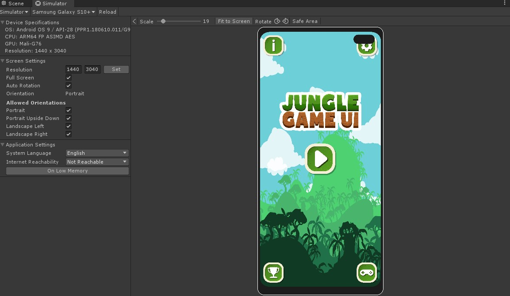
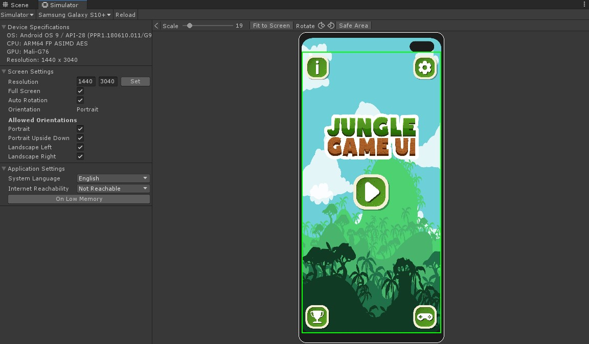
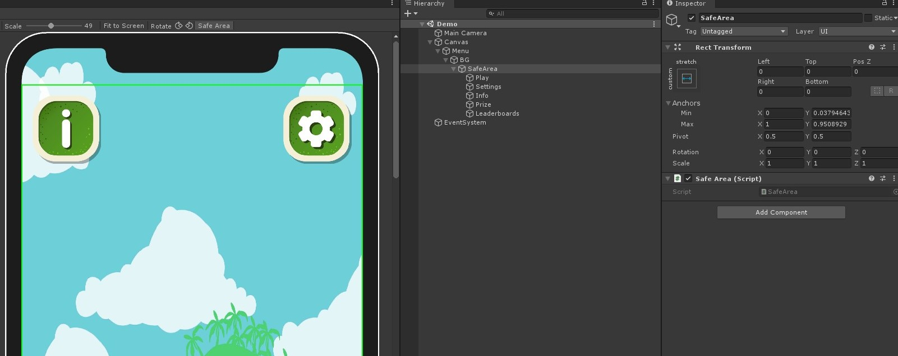

<h1 align="center" style="border-bottom: none;">
  <a href="https://github.com/MohitSethi99/UnityNotchSolution/">Unity Notch Solution</a>
</h1>

<p align="center">
  <a href=""></a>
  
  <a href=""></a>
  <br/>
</p>

Thanks for checking out the project!

> This framework will remain `Open Source`

## Status and prerequisites

Current status at a glance:
```
Unity version: 2019.4.21f1 LTS
Packages	  : Device Simulator (For testing inside editor)
```


## Features

- Easy To Use Notch Solution
- Plug and Play

<p align="center">
    
    Notch issue.
</p>

<p align="center">
    
    Notch Solution.
</p>


## Setting Up

- Make a new gameObject as the child of Background image in the panel and rename it to SafeAreaHolder.
- Attach The SafeArea Script To SafeAreaHolder gameObject.
- Shift all your UI gameObjects inside the SafeAreaHolder gameObject making them the children of SafeAreaHolder.
- Open device simulator and switch to any of the notched devices to test.
- See the below config for more clarification or open the Demo scene.

<p align="center">
    
    Config.
</p>
